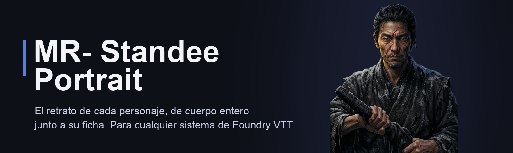
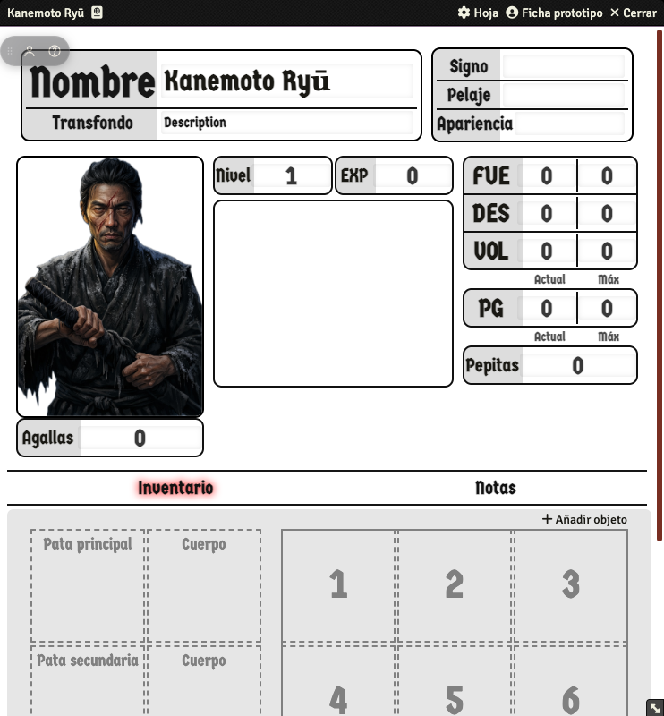
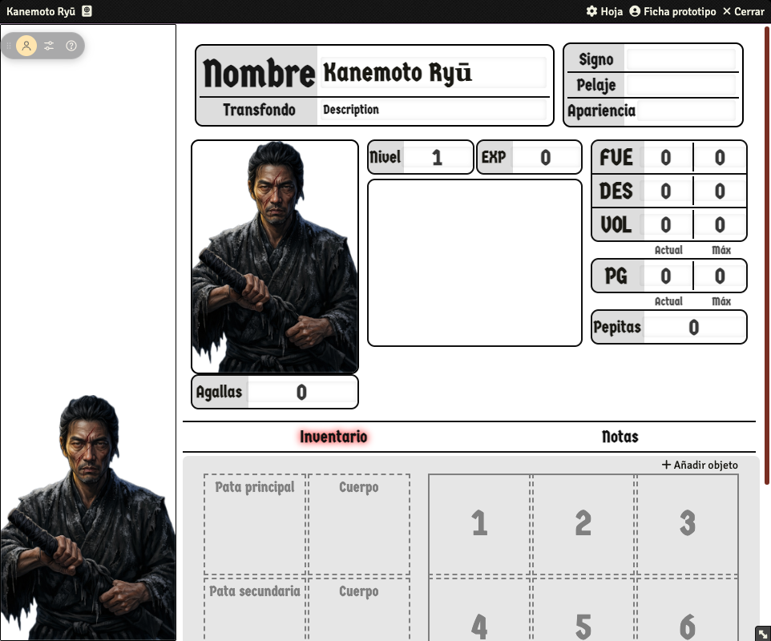
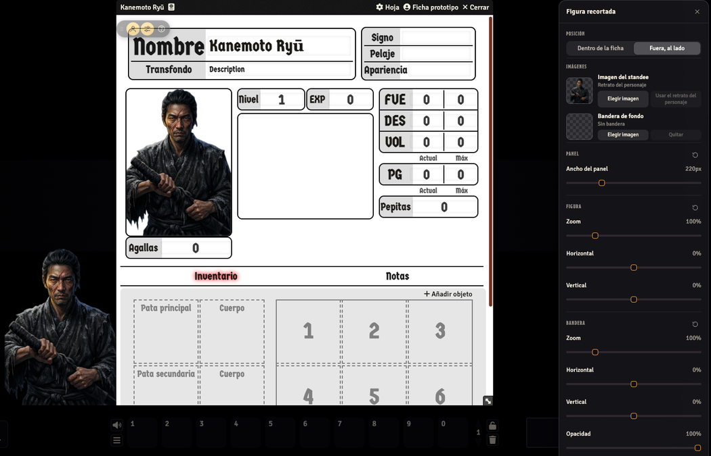

<p align="center">
  
</p>

# MR- Standee Portrait

<p align="center">
  <a href="https://github.com/ManuRomera/mr-standee-portrait/releases/latest"></a>
  <a href="https://foundryvtt.com"></a>
  <a href="https://github.com/ManuRomera/mr-standee-portrait/releases"></a>
  
</p>

> ⚠️ **WIP — Trabajo en curso.** Este módulo está en desarrollo activo. La funcionalidad básica ya funciona, pero puede haber cambios de comportamiento entre versiones y aún no está probado a fondo en todos los sistemas de juego. Úsalo en mundos de prueba antes de un mundo de partida activa, y abre un [issue](https://github.com/ManuRomera/mr-standee-portrait/issues) si algo falla.

Módulo para [Foundry VTT](https://foundryvtt.com/) que muestra el retrato de cualquier ficha de personaje como una **figura recortada a cuerpo entero** que sobresale del marco de la hoja, con una **imagen de fondo tipo bandera** detrás. Todo es ajustable (tamaño, zoom, posición y opacidad) y se guarda por personaje.

Funciona con **cualquier sistema de juego**: no depende de la plantilla ni del CSS propio de cada hoja, solo engancha en el render de la ficha de actor y añade su propio panel, redimensionando la ventana para hacerle sitio.

> **¿Vienes de «Standee Portrait» (`standee-portrait`)?** El módulo se ha renombrado a **MR- Standee Portrait** (id `mr-standee-portrait`). Foundry trata un id nuevo como otro paquete, así que hay que instalar este y desactivar/desinstalar el antiguo. Al cargar un mundo, el GM migra automáticamente los ajustes guardados en cada personaje (se copian, no se borran).

## Así se ve

Misma ficha, sin y con el módulo (el arte es un personaje de [Ocho Lanzas](https://github.com/ManuRomera/ocho-lanzas) recortado del fondo):

<p align="center">
  
  
</p>

Y en modo «Fuera, al lado», con la ventana de ajustes abierta (posición, imágenes, zoom y bandera de fondo):

<p align="center">
  
</p>

## Instalación

En Foundry VTT: **Configuración > Módulos complementarios > Instalar módulo** y pega este manifest:

```
https://github.com/ManuRomera/mr-standee-portrait/releases/latest/download/module.json
```

Luego actívalo en el mundo desde **Gestionar módulos**.

## Importante: qué imagen usar

Tanto el retrato como la bandera se muestran con `object-fit: contain` sobre fondo **transparente** (no hay caja, marco ni recorte forzado a rectángulo). Esto significa que el resultado solo se ve "recortado y orgánico" si la imagen ya tiene el fondo transparente (PNG con alpha), como suele pasar con el arte de token o con banderas/pendones ilustrados con su propia silueta. Si usas una imagen rectangular normal (una ilustración con fondo sólido), verás ese rectángulo completo — el módulo no recorta el sujeto automáticamente, solo respeta la transparencia que ya tenga el archivo.

## Cómo funciona

En cada ficha de actor aparece un pequeño grupo de botones (el "hub") dentro de la ventana, cerca de la esquina superior izquierda por defecto. Estos controles **viven siempre dentro de la ficha** — nunca se dibujan sobre la imagen del personaje, para no romper la estética de un standee limpio.

- **Muévelo** con el asa de puntos (⋮⋮) o con el botón derecho del ratón sobre cualquier parte; la posición se guarda por personaje. Si la ventana se hace pequeña, el hub se mantiene siempre al alcance.
- El icono de **figura** activa/desactiva el modo standee (solo con permiso de edición). Los jugadores sin permiso solo ven el botón de ayuda.
- Una vez activo aparece el icono de **ajustes**, que abre una **ventana flotante** (arrastrable por la cabecera) que **permanece abierta** mientras ajustas: los deslizadores se ven en directo y se guardan al soltarlos, sin re-renderizar la ficha. Clic en el nombre de un deslizador = valor por defecto; el icono ↺ de cada bloque restablece el bloque entero.
  - **Posición**: "Dentro de la ficha" (por defecto) integra la imagen en la propia ventana, ensanchándola (suma al relleno propio de la hoja). "Fuera, al lado" la saca de la ventana: flota junto a ella, la sigue, se oculta al minimizar y pasa al lado derecho si la ventana está pegada al borde izquierdo de la pantalla.
  - **Imágenes**: miniatura con fondo de ajedrez (para ver la transparencia) y botones para cambiar/quitar. "Usar el retrato del personaje" vuelve a `actor.img`; el retrato real del actor nunca se modifica.
  - **Panel / Figura / Bandera**: ancho del panel, zoom y posición de cada imagen, y opacidad de la bandera.

La imagen en sí (retrato + bandera) no tiene ningún botón encima: es solo el arte, tal como pide un standee limpio.

Todos los ajustes se guardan como flags del propio actor (`flags.standee-portrait.config`), así que son independientes por personaje y persisten entre sesiones. Los jugadores sin permisos de edición ven el resultado, pero solo el propietario (o el GM) puede modificarlo.

## Ayuda dentro del juego

El módulo genera automáticamente una entrada de diario ("Standee Portrait — Ayuda" / "— Help") con todo esto explicado, visible tanto para el GM como para los jugadores (permiso de solo lectura). La primera vez que se carga el mundo con el módulo activo, se envía un único mensaje de chat público con un enlace a esa página — no vuelve a repetirse. El botón **❓** del hub la reabre en cualquier momento.

## Idioma

La interfaz está disponible en **español** e **inglés**, y se selecciona automáticamente según el idioma configurado en Foundry (Configuración > Idioma), igual que cualquier otro módulo o sistema — usa `lang/es.json` o `lang/en.json` según corresponda. La entrada de diario de ayuda también se genera en el idioma activo en el momento de crearla.

## Compatibilidad

- Foundry VTT v12 y v13 (probado en 13.351).
- Cualquier sistema de juego, ya sean hojas clásicas (`ActorSheet`) o de la nueva API (`ActorSheetV2`).

## Desarrollo / releases

El versionado sigue [SemVer](https://semver.org/lang/es/). Cada `git tag vX.Y.Z` publicado dispara una GitHub Action que empaqueta el módulo y crea el release con `module.json` y `module.zip` adjuntos, de forma que el manifest de instalación (`releases/latest/download/module.json`) siempre apunta a la última versión publicada.

## Licencia

Pendiente de definir.
